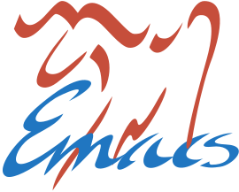

                                   *GNU Emacs*

*Vault*  /file = ID--title__form_matter/      *form*                      *matter*

  Attach: file → Files/ .... [C-c d a]    hub       paperidea       aesthetics    math
  Backlinks ................ [C-c d b]    idea      poetry          concepts      neo-kantian
  Insert link .............. [C-c d k]    lit       presentation    fun           phenomenology
  Promote / rename ......... [C-c d r]    log       talk            hegel         physics
                                          meeting   wip             history       science
                                          musing                    kant          teaching

*Tasks*                                   *find*

  Capture a task ............... [c t]    by name .............. [f / C-c d f]
  Progress the state ... [C-c C-t / r]    by content ........... [g / C-c d g]
  Todos, all ..................... [t]    list ................. [l / C-c d l]
  Todos, by tag ................ [a m]

*Commands*                                     /C = Ctrl (CapsLock too) · M = Alt/

  Act on thing at point ........ [C-.]    Papers ......................... [p]
  Agenda / capture ........... [a / c]    Resize windows ........ [C-c w hjkl]
  Back → splash floor .......... [ESC]    Save ..................... [C-a C-s]
  Close buffer ............... [C-a k]    Scratch ................ [s / C-c s]
  File in project .......... [C-a p f]    Search in buffer ........... [M-s l]
  File to split ........ [C-c w f / b]    Swap windows ............. [C-c w w]
  Jump / swap .................. [M-o]    Switch buffer .... [M-ESC / C-a b]
  Move to window ......... [C-h j k l]    Undo / redo .......... [C-z / C-S-z]
  New note ....................... [n]    Window menu ................ [C-c w]
